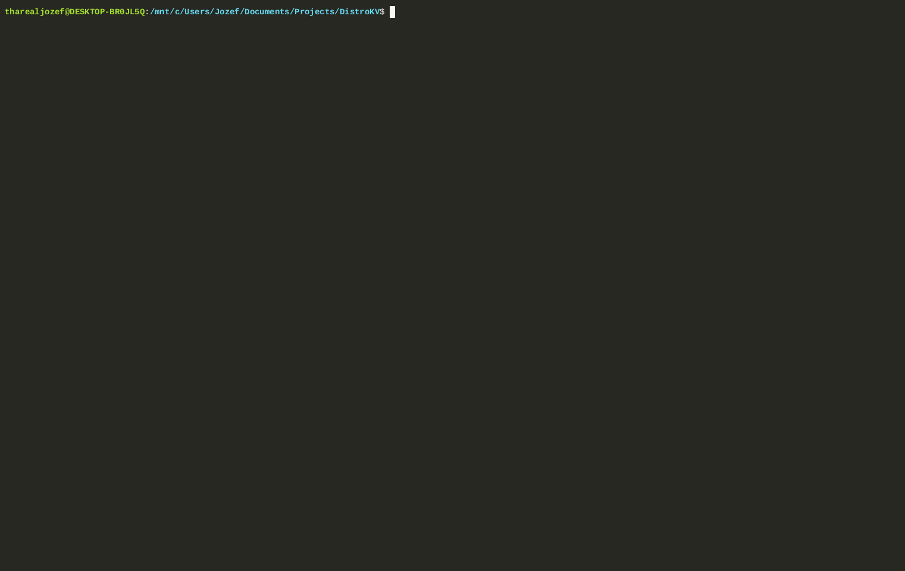
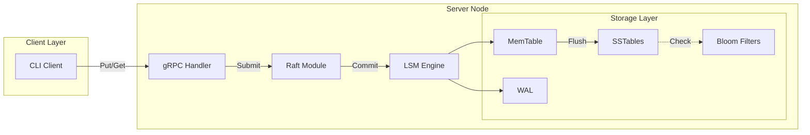

# 🚀 DistroKV

<div align="center">

**A Distributed Key-Value Store Built From Scratch in Go**

*Raft Consensus • LSM Tree Storage • gRPC Protocol*

[](https://golang.org/)
[](https://raft.github.io/)
[](https://en.wikipedia.org/wiki/Log-structured_merge-tree)
[](LICENSE)

</div>

---

## ⚡ Why DistroKV?

| Feature | DistroKV | Redis | etcd | BadgerDB |
|---------|:--------:|:-----:|:----:|:--------:|
| **Built From Scratch** | ✅ | ❌ | ❌ | ❌ |
| **Raft Consensus** | ✅ | ❌ | ✅ | ❌ |
| **LSM Tree Engine** | ✅ | ❌ | ❌ | ✅ |
| **Bloom Filters** | ✅ | ❌ | ❌ | ✅ |
| **Background Compaction** | ✅ | ❌ | ❌ | ✅ |
| **WAL Recovery** | ✅ | ✅ | ✅ | ✅ |
| **Educational Value** | ⭐⭐⭐ | ⭐ | ⭐ | ⭐⭐ |

> **💡 The Difference:** Unlike production databases that wrap existing libraries, DistroKV implements every core algorithm **from scratch** — demonstrating deep understanding of distributed systems and storage engine internals.

---

## 🎬 Demo

<div align="center">



*Server (left) processes Raft consensus while Client (right) performs CRUD operations*

</div>

---

## 🏗️ Architecture



### 🧠 The Brain (Raft Consensus)
- **Leader Election** — Randomized timeouts, term management
- **Log Replication** — AppendEntries RPC, consistency guarantees
- **Safety** — Persistent HardState (`raft_state.json`)

### 💾 The Memory (LSM Tree)
- **MemTable** — In-memory sorted map (fast writes)
- **WAL** — Write-ahead log for crash recovery
- **SSTable** — Immutable sorted files (auto-flush at 100 keys)
- **Bloom Filters** — Skip disk reads for missing keys
- **Compaction** — Background merge every 60 seconds

### 🔌 The Nervous System
- **gRPC + Protobuf** — Type-safe binary protocol
- **Gob Serialization** — Efficient command encoding

---

## 🚀 Quick Start

```bash
# Clone & Build
git clone https://github.com/ThaRealJozef/DistroKV.git
cd DistroKV
go build -o bin/server.exe ./cmd/server
go build -o bin/client.exe ./cmd/client

# Start Server (auto-elects as Leader)
./bin/server.exe node1 50051

# In another terminal - Write & Read
./bin/client.exe -addr localhost:50051 -op put -key mykey -val "hello"
./bin/client.exe -addr localhost:50051 -op get -key mykey
```

### 🧪 Performance Demo
Watch **flushing**, **bloom filters**, and **compaction** in action:
```powershell
./verify_flush.ps1
```

---

## 📊 Performance Characteristics

| Operation | Complexity | Notes |
|-----------|------------|-------|
| **Write** | O(1) | Direct to MemTable + WAL |
| **Read (Hot)** | O(1) | Found in MemTable |
| **Read (Cold)** | O(log N) | Bloom check → SSTable scan |
| **Flush** | O(N log N) | Sort + write to disk |
| **Compaction** | O(N) | Merge all SSTables |

---

## 📁 Project Structure

```
DistroKV/
├── cmd/
│   ├── server/main.go    # Server entrypoint
│   └── client/main.go    # CLI client
├── internal/
│   ├── raft/             # Consensus implementation
│   │   ├── raft.go       # Core Raft logic
│   │   └── storage.go    # HardState persistence
│   ├── lsm/              # Storage engine
│   │   ├── memtable.go   # In-memory table
│   │   ├── wal.go        # Write-ahead log
│   │   ├── sstable.go    # Sorted string tables
│   │   ├── compaction.go # Background merger
│   │   └── store.go      # LSM orchestrator
│   ├── server/           # gRPC handlers
│   └── utils/
│       └── bloom.go      # Bloom filter
└── proto/                # Protobuf definitions
```

---

## 🎯 What This Demonstrates

- ✅ **Distributed Systems** — Raft consensus, leader election, log replication
- ✅ **Storage Engines** — LSM trees, compaction strategies, bloom filters
- ✅ **Systems Programming** — Concurrent Go, binary protocols, crash recovery
- ✅ **Software Architecture** — Clean separation of concerns, testable design

---

## 📝 License

MIT © [Jozef](https://github.com/ThaRealJozef)

---

<div align="center">

**Built with 💻 and ☕ by [Jozef](https://github.com/ThaRealJozef)**

*If you found this useful, consider giving it a ⭐*

</div>
