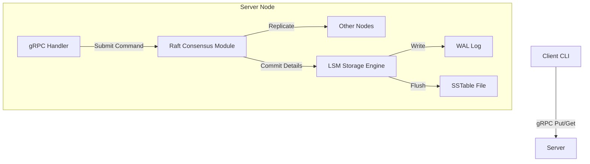

# 🚀 DistroKV

> A Distributed Key-Value Store built from scratch in Go.
> **Architecture:** Raft Consensus + LSM Tree + gRPC.


## 📖 Overview

**DistroKV** is an educational distributed database designed to explore the internals of system consistency and storage engines. 

Unlike wrapping existing libraries (like `etcd` or `BadgerDB`), DistroKV implements the core algorithms **manually** to demonstrate deep understanding of distributed systems:

*   **The Brain (Consensus):** A custom implementation of the **Raft** consensus algorithm (Leader Election, Log Replication).
*   **The Memory (Storage):** A custom **LSM Tree** (Log-Structured Merge Tree) with MemTable, WAL (Write-Ahead Log), and SSTable flushing.
*   **The Nervous System:** **gRPC** with Protocol Buffers for typed node communication.

## 🏗️ Architecture



## 🚀 Getting Started

### Prerequisites
- Go 1.25+
- Protoc (Protocol Buffers Compiler)

### Installation
```bash
git clone https://github.com/ThaRealJozef/DistroKV.git
cd DistroKV
go mod tidy
```

### Running the Server
Start a single node (Leader automatically elected in single-node mode):
```powershell
go build -o bin/server.exe ./cmd/server
./bin/server.exe node1 50051
```

### Running the Client
Open a new terminal to interact with the store:
```powershell
go build -o bin/client.exe ./cmd/client

# Write Data
./bin/client.exe -addr localhost:50051 -op put -key user:101 -val "Jozef"

# Read Data
./bin/client.exe -addr localhost:50051 -op get -key user:101
```

## 🛠️ Technical Details

### Implemented Features
- **Raft Leader Election:** Randomized election timeouts, Term management.
- **Log Replication:** AppendEntries RPC, Consistency checks.
- **LSM Storage:** 
    - **MemTable:** In-memory mutable storage (thread-safe).
    - **WAL:** Append-only log for durability.
    - **SSTable:** Immutable disk files (sorted flush).
- **Network:** gRPC streaming and unary calls.

### Limitations (MVP)
- **Crash Recovery:** WAL replay on startup is currently a "Future Work" item (Data persists to disk but isn't auto-loaded).
- **Cluster Membership:** Static configuration.

## 📝 License
MIT
